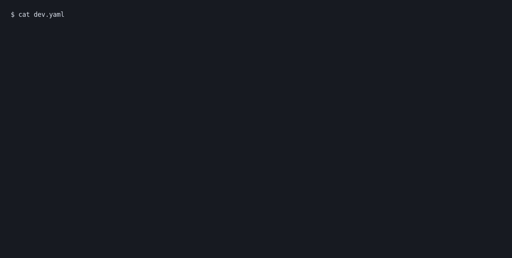

# 🪴 Terrarium

> ⚠️ **Under construction — docs are incomplete and the code is still under
> internal review. Use with caution.** ⚠️

> Give your agent room to work. Decide what it can touch.

[](https://github.com/terrarium-sh/terrarium/actions)
[](https://github.com/terrarium-sh/terrarium/releases/latest)
[](LICENSE)

Run coding agents and development tools in a hardware-virtualized microVM.
One self-contained `terra` binary, one YAML recipe, and explicit grants for
host files and network access. No host files or network access by default.

**Keep it simple, keep it auditable.** Terrarium keeps a small core that is easy
to understand and review. Recipes, lifecycle hooks, and external tools add what
you need without growing the core.

**The virtual devices are sandboxed too.** Device components run in separate
WebAssembly sandboxes with scoped host access: a filesystem device gets its
granted directory, a network device policy-controlled sockets. The microVM
isolates the workload; the sandboxes limit what the code handling guest requests
can do. See the [security model](docs/security.md).

Supported hosts: Linux amd64 and aarch64, macOS on Apple Silicon, and Windows
amd64. Build requirements: [README.dev.md](README.dev.md).

## Quickstart

```sh
curl -fsSLO https://raw.githubusercontent.com/terrarium-sh/terrarium/main/install.sh
sh install.sh
terra --version
```

On Windows (PowerShell):

```powershell
Invoke-WebRequest -UseBasicParsing https://raw.githubusercontent.com/terrarium-sh/terrarium/main/install.ps1 -OutFile install.ps1
powershell -ExecutionPolicy Bypass -File install.ps1
```

`install.ps1` installs `terra.exe` to `%LOCALAPPDATA%\Programs\terra`, adds that
directory to the user `PATH` (open a new terminal afterwards), takes
`-Prerelease`, and honors `$env:TERRA_VERSION`.

The installer verifies the release checksum and also verifies its GitHub attestation when the GitHub CLI is installed. Pin a release with
`TERRA_VERSION=x.y.z sh install.sh`; re-run it to upgrade, or pass
`--prerelease` to take the newest release even when it is a prerelease. Build from source:
[README.dev.md](README.dev.md) using the pinned Rust toolchains. Verify a release archive with
`gh attestation verify terra-x86_64-linux.tar.gz --repo terrarium-sh/terrarium`
after downloading the matching release archive.

Then sandbox a project:

```sh
cd ~/code/my-app
cat > dev.yaml <<'EOF'
hw: { cpus: 2, mem_mib: 1024 }
components: { memory_mib: 16, total_memory_mib: 128 }
network:
  mode: unrestricted-public              # public egress; host and private networks stay blocked
workload:
  entrypoint: /bin/sh                    # a shell instead of your app's cmd
EOF
terra ./dev.yaml setup      # pin the recipe, build the box
terra                       # boot it — a shell in the guest
```

The example opts in to public egress for package managers and agents. Remove
`network:` for no network, or use `mode: allowlist` for a narrower policy.



`terra` boots the only box in the directory, or joins it if already up. Detach
with `Ctrl-\`, rejoin with `terra`, stop with `terra stop`, delete with `terra rm`.
Use `terra put` and `terra get` to transfer one file at a time. Detailed
instructions: [docs/usage.md](docs/usage.md).

## What you get

- **Real isolation.** Each box is a microVM, not a container.
- **Explicit access.** No host files or network by default; the host, LAN, and
  private ranges stay blocked unless a recipe names them. Grant host directories
  with `mounts`, or transfer individual files with `put` and `get`.
- **One binary.** The guest kernel, base guest filesystem, and VM components
  are embedded in `terra`; no daemon required. The kernel loads directly into
  memory on each boot. Upgrade Terra and stop/start a box to use the kernel
  bundled with that release, without rebuilding the box.
  Recipe hooks can install additional packages.
- **Lifecycle hooks.** `on_create`, `on_start`, and `pre_stop` run as guest
  root. Startup and stop output appears live in the attached console, with the
  workload between them. Package installation usually belongs in `on_create`.
- **Work without rebuilding.** Detach, rejoin, copy files, or run `terra exec`
  in a live box.

## Commands

| command | what it does |
|---|---|
| `terra [BOX] setup` | pin the recipe, build the box |
| `terra [BOX]` | boot it — or join it if it's up (`-d`: headless) |
| `terra [BOX] -- CMD…` | run CMD instead of the recipe's workload, for one boot |
| `terra [BOX] exec/put/get` | run a command or copy one file |
| `terra [BOX] logs/sessions/detach` | inspect or manage a live box |
| `terra [BOX] stop/rm` | stop it gracefully / delete it |
| `terra ls` | list boxes in this directory (`--all`: every project) |

`[BOX]` defaults to the directory's only box. Full reference:
[docs/usage.md](docs/usage.md).

## Storage

Boxes live at `~/.terra/box/t-<project-slug>/<box>/`, where the slug is a stable
base32 hash of the project path. The kernel and read-only boot disk load into
memory from the Terra binary on every boot. `terra ls --all` finds boxes, and
`terra <box> rm --purge --project <project-dir>` removes one completely. To use
another disk, stop boxes, move `~/.terra`, then symlink it back; the target must
honour owner-only permissions.

## Security

The VM is the boundary. Each host-directory mount has its own filesystem
component and directory grant, with read-only enforcement on the host.
Read the [security model](docs/security.md), or
[report a vulnerability privately](https://github.com/terrarium-sh/terrarium/security/advisories/new).

## Documentation

- [Recipe reference](docs/recipe.md)
- [Project manifest (`terra.yaml`)](docs/manifest.md)
- [Usage and storage](docs/usage.md)
- [Demo](docs/demo.gif)
- [Security model](docs/security.md)
- [Development and release](README.dev.md)
- [Audit follow-up](docs/audit-followup.md)
- [Systemd and man pages](packaging/README.md)
- [Security policy](SECURITY.md)

## License

Apache-2.0. See [LICENSE](LICENSE) and [NOTICE](NOTICE).
