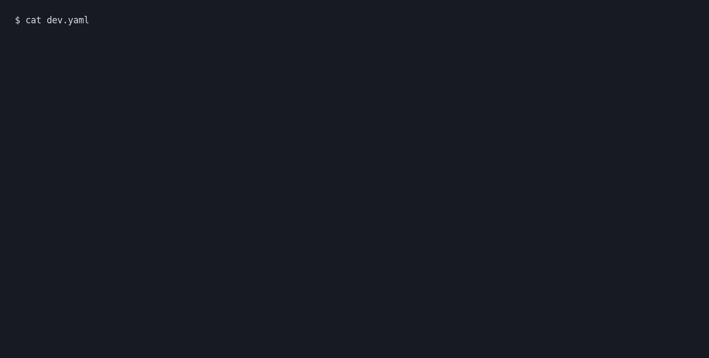

# 🪴 Terrarium

**Give your agent room to work. Decide what it can touch.**

Run coding agents and development tools in a hardware-virtualized microVM,
with explicit control over host files and network access. Get started with
one `terra` executable and a YAML recipe.

[](https://github.com/terrarium-sh/terrarium/actions)
[](https://github.com/terrarium-sh/terrarium/releases/latest)
[](LICENSE)

- **A dedicated kernel for every box.** Hardware virtualization isolates the
  workload from the host, including guest root.
- **Device components are sandboxed too.** Separate WebAssembly sandboxes
  restrict the code handling guest requests to scoped host capabilities.
  Linux adds Bubblewrap containment around the VM process by default.
- **Access starts at zero.** No host files or network access by default.
  Grant specific directories, enforce read-only mounts, and allow network
  destinations by hostname, IP, or CIDR and port.
- **An embedded runtime, no daemon to manage.** The guest kernel, base filesystem,
  and VM components ship inside `terra`. Recipes define resources, access,
  package installation, and the workload.
- **Keep working in the same box.** Detach and rejoin, run commands, or sync
  files without rebuilding. Guest storage persists between restarts.

Read the [security model and its limits](docs/security.md).
**Under construction:** docs are incomplete and code is still under internal review.

## Quickstart

Supported hosts: Linux amd64 and aarch64, macOS on Apple Silicon, and Windows
amd64 and ARM64. Linux requires access to `/dev/kvm`; Windows requires Windows
Hypervisor Platform. See [platform requirements](packaging/README.md#native-host-builds).

Install on Linux or macOS:

```sh
curl -fsSLO https://raw.githubusercontent.com/terrarium-sh/terrarium/main/install.sh && sh install.sh
```

<details>
<summary>Install on Windows (PowerShell)</summary>

```powershell
Invoke-WebRequest -UseBasicParsing https://raw.githubusercontent.com/terrarium-sh/terrarium/main/install.ps1 -OutFile install.ps1; if ($?) { powershell -ExecutionPolicy Bypass -File install.ps1 }
```

Open a new terminal after installation.

</details>

In your project directory, create `dev.yaml`. Here's a Node.js development box:

```yaml
hw:
  cpus: 2
  mem_mib: 2048
  rootfs_mib: 4096
mounts:
  - host: .
    guest: /work
    readonly: false
network:
  mode: allowlist
  allow:
    - dl-cdn.alpinelinux.org:443
    - registry.npmjs.org:443
hooks:
  on_create:
    - apk add --no-cache nodejs npm git
workload:
  entrypoint: /bin/sh
  workdir: /work
```

This installs Node.js, npm, and Git, shares your project read-write at `/work`,
and allows HTTPS access to the Alpine and npm package registries. Add the
destinations your tools need to `network.allow`.

```sh
terra ./dev.yaml setup   # create the box and install tools
terra                   # enter the guest shell at /work
```

Project edits are shared with the host. This includes `dev.yaml`, so review
the recipe before rerunning setup. See [recipe trust](docs/security.md#recipe-storage).

Press `Ctrl-\` to detach while keeping the box running. From the host:

```sh
terra exec -- node --version   # run a command in the guest
terra                         # rejoin the shell
```

Use `terra stop` to stop the box and `terra rm` to delete its storage.
See the [recipe reference](docs/recipe.md) to customize tools, access, and workloads.



## Go further

- [Usage guide](docs/usage.md) — installation options, commands, file sync, and storage.
- [Recipe reference](docs/recipe.md) — network access, mounts, packages, and workloads.
- [Project manifest](docs/manifest.md) — manage multiple boxes with `terra.yaml`.
- [Security model](docs/security.md) — trust boundaries, enforcement, and limitations.
- [Host VM launchers](docs/vm-launchers.md) — Linux containment and seccomp policies.
- [Development](README.dev.md) — build from source, test, and release.
- [Packaging](packaging/README.md) — platform requirements, systemd, and man pages.
- [Security policy](SECURITY.md) — report a vulnerability privately.

Apache-2.0. See [LICENSE](LICENSE) and [NOTICE](NOTICE).
